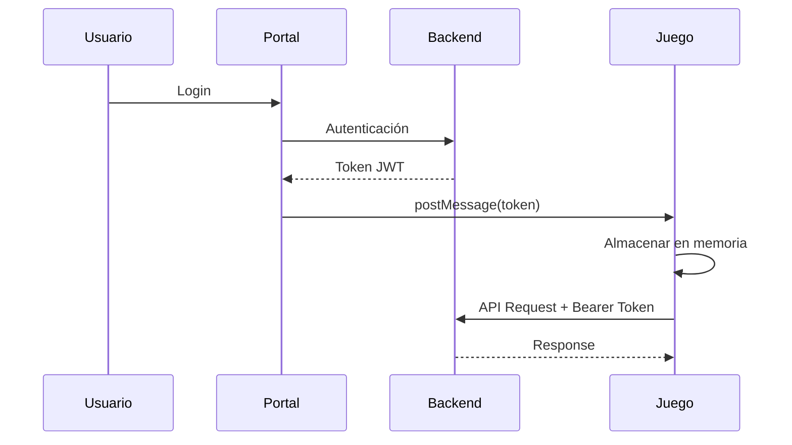

# Contrato de API para Daring Dungeon Delver

**Responsables:** Andrés Álvarez Morales, Enrique Pincheira  
**Proyecto:** Ufro GameLab - Módulo de Juego Daring Dungeon Delver  
**Versión de la API:** v2  
**Contrato ID:** #DDD-API-03  
**Base URL:** `https://ufrogamelab.cl/v2`

---

## Sistema de Autenticación y Token

| Campo                      | Detalle                                                                      |
| -------------------------- | ---------------------------------------------------------------------------- |
| **Tipo de Token**          | Bearer Token (JWT firmado por Ufro GameLab)                                  |
| **Cabecera HTTP**          | `Authorization: Bearer <token>`                                              |
| **Emisión**                | Backend de Ufro GameLab tras login exitoso en el portal                      |
| **Transferencia al juego** | `window.postMessage` desde el portal al juego                                |
| **Almacenamiento**         | Sólo en memoria (no `localStorage`/cookies)                                  |
| **Renovación**             | Si la API responde `401`, el juego solicita un nuevo token vía `postMessage` |
| **Seguridad**              | HTTPS, validación de origen, expiración y firma JWT                          |

### Flujo de Autenticación



---

## Endpoints Disponibles

### 1. Actualizar Sesión de Juego

**Descripción:** Actualiza acumulados de tiempo jugado y mejor puntaje personal

| Campo                     | Detalle                                                            |
| ------------------------- | ------------------------------------------------------------------ |
| **Ruta del Endpoint**     | `/collection/my-games/{gameId}/session-update`                     |
| **Método HTTP**           | `PUT`                                                              |
| **URL completa**          | `https://ufrogamelab.cl/v2/collection/my-games/ddd/session-update` |
| **Parámetros de entrada** | `gameId` (path, requerido)                                         |
| **Cabeceras requeridas**  | `Authorization: Bearer <token>`, `Content-Type: application/json`  |
| **Autenticación**         | Requerida (JWT)                                                    |

#### Cuerpo de Solicitud

```json
{
  "gameSessionDurationSeconds": 3600,
  "scoreAchieved": 15000
}
```

#### Respuestas

| Código HTTP               | Descripción        | Ejemplo de respuesta JSON                                                                                                                                                                        |
| ------------------------- | ------------------ | ------------------------------------------------------------------------------------------------------------------------------------------------------------------------------------------------ |
| 200 OK                    | Sesión actualizada | `{"success":true,"data":{"gameId":101,"totalPlaytimeSeconds":10800,"highScore":20000},"error":null}`                                                                                             |
| 400 Bad Request           | Validación         | `{"success":false,"data":null,"error":{"code":"VALIDATION_ERROR","message":"gameSessionDurationSeconds debe ser >= 1.","details":[{"field":"gameSessionDurationSeconds","issue":"min_1"}]}}`     |
| 401 Unauthorized          | Token inválido     | `{"success":false,"data":null,"error":{"code":"UNAUTHORIZED","message":"Token inválido o ausente.","details":[]}}`                                                                               |
| 403 Forbidden             | No posee el juego  | `{"success":false,"data":null,"error":{"code":"LIBRARY_OWNERSHIP_REQUIRED","message":"El usuario no posee el juego.","details":[]}}`                                                             |
| 404 Not Found             | Juego no existe    | `{"success":false,"data":null,"error":{"code":"LIBRARY_GAME_NOT_FOUND","message":"Juego no existe en la colección.","details":[]}}`                                                              |
| 500 Internal Server Error | Error interno      | `{"success":false,"data":null,"error":{"code":"INTERNAL_ERROR","message":"Ocurrió un error interno en el servidor.","details":[]}}`                                                              |

**Notas adicionales:** Se reemplazaron las claves anteriores (`duration_seconds`, `score`) por `gameSessionDurationSeconds` y `scoreAchieved` para alinear con el contrato de biblioteca.

---

### 2. Obtener Rankings (Leaderboard)

**Descripción:** Retorna ranking global del juego

| Campo                     | Detalle                                                          |
| ------------------------- | ---------------------------------------------------------------- |
| **Ruta del Endpoint**     | `/collection/leaderboards/{gameId}`                              |
| **Método HTTP**           | `GET`                                                            |
| **URL completa**          | `https://ufrogamelab.cl/v2/collection/leaderboards/ddd?limit=10` |
| **Parámetros de entrada** | `gameId` (path, requerido) · `limit` (query, opcional, integer)  |
| **Cabeceras requeridas**  | `Authorization: Bearer <token>`                                  |
| **Cuerpo de solicitud**   | No aplica                                                        |
| **Autenticación**         | Requerida (JWT)                                                  |

#### Respuestas

| Código HTTP               | Descripción           | Ejemplo de respuesta JSON                                                                                                                                                                           |
| ------------------------- | --------------------- | --------------------------------------------------------------------------------------------------------------------------------------------------------------------------------------------------- |
| 200 OK                    | Ranking obtenido      | `{"success":true,"data":{"gameId":101,"gameTitle":"Daring Dungeon Delver","leaderboard":[{"rank":1,"nickname":"PlayerPro","score":150000},{"rank":2,"nickname":"UFRODev","score":120000}]},"error":null}` |
| 401 Unauthorized          | Token inválido        | `{"success":false,"data":null,"error":{"code":"UNAUTHORIZED","message":"Token inválido o ausente.","details":[]}}`                                                                                  |
| 404 Not Found             | Juego sin leaderboard | `{"success":false,"data":null,"error":{"code":"LIBRARY_GAME_NOT_FOUND","message":"Juego no existe en la colección.","details":[]}}`                                                                 |
| 500 Internal Server Error | Error interno         | `{"success":false,"data":null,"error":{"code":"INTERNAL_ERROR","message":"Ocurrió un error interno en el servidor.","details":[]}}`                                                                 |

---

## Roles y Responsabilidades

| Componente               | Rol Principal              | Responsabilidad                                                     |
| ------------------------ | -------------------------- | ------------------------------------------------------------------- |
| **Backend Ufro GameLab** | Autoridad de autenticación | Emitir/validar JWT, asociar token a usuario                         |
| **Portal Ufro GameLab**  | Intermediario de sesión    | Transferir/renovar token vía `postMessage`                          |
| **Juego (Phaser)**       | Cliente consumidor         | Mantener token en memoria y adjuntarlo en cada request              |
| **API de GameLab**       | Receptor de datos          | Validar token y procesar endpoints de biblioteca/sesión/leaderboard |

---

## Implementación en el Cliente

### Archivos Relacionados

```
src/
├── services/
│   └── GameLabClient.ts          # Cliente principal de API
├── integration/
│   ├── ApiClient.ts              # HTTP client con reintentos
│   ├── SessionService.ts         # Servicio de sesiones
│   ├── LeaderboardsService.ts    # Servicio de rankings
│   └── response.ts               # Parseo de respuestas
├── auth/
│   ├── AuthProvider.ts           # Gestión de tokens
│   └── TokenMemoryStore.ts       # Almacenamiento en memoria
└── runtime/
    └── SessionManager.ts         # Telemetría y heartbeats
```

### Ejemplo de Uso

```typescript
import { createApiClient } from '@/integration/ApiClient'
import { createAuthProvider } from '@/auth/AuthProvider'

// Inicializar proveedor de autenticación
const authProvider = createAuthProvider({
  allowedOrigin: 'https://ufrogamelab.cl'
})

// Inicializar cliente de API
const apiClient = createApiClient({
  baseUrl: 'https://ufrogamelab.cl/v2',
  authProvider
})

// Actualizar sesión
await apiClient.sessionService.updateSession('ddd', {
  gameSessionDurationSeconds: 3600,
  scoreAchieved: 15000
})

// Obtener leaderboard
const leaderboard = await apiClient.leaderboardsService.getLeaderboard('ddd', {
  limit: 10
})
```

---

## Manejo de Errores y Reintentos

### Política de Reintentos

| Código de Error | Acción                             | Reintentos | Backoff      |
| --------------- | ---------------------------------- | ---------- | ------------ |
| 401             | Solicitar nuevo token              | 1 vez      | Inmediato    |
| 429             | Esperar según `Retry-After`        | 3          | Exponencial  |
| 5xx             | Reintentar con backoff exponencial | 3          | Exponencial  |
| 4xx (otros)     | No reintentar                      | 0          | N/A          |

### Códigos de Error Personalizados

```typescript
enum ApiErrorCode {
  VALIDATION_ERROR = 'VALIDATION_ERROR',
  UNAUTHORIZED = 'UNAUTHORIZED',
  LIBRARY_OWNERSHIP_REQUIRED = 'LIBRARY_OWNERSHIP_REQUIRED',
  LIBRARY_GAME_NOT_FOUND = 'LIBRARY_GAME_NOT_FOUND',
  INTERNAL_ERROR = 'INTERNAL_ERROR'
}
```

---

## Seguridad

### Validaciones del Cliente

1. **Origen del postMessage:** Solo aceptar mensajes de `https://ufrogamelab.cl`
2. **Almacenamiento del token:** Solo en memoria, nunca en `localStorage`
3. **HTTPS obligatorio:** Todas las peticiones deben usar HTTPS
4. **Validación de respuesta:** Verificar estructura JSON antes de procesar

### Validaciones del Servidor

1. **Firma JWT:** Validar que el token esté firmado correctamente
2. **Expiración:** Verificar que el token no haya expirado
3. **Asociación de usuario:** Confirmar que el token corresponde a un usuario válido
4. **Propiedad del juego:** Verificar que el usuario posea el juego (para session-update)

---

## Testing

Ver [Informe de Pruebas](../06_PRUEBAS/test_report.md) para detalles sobre:
- Tests unitarios de servicios
- Tests de integración E2E
- Cobertura de casos de error
- Validación de handshake con postMessage

---

## Compatibilidad

**Versiones Soportadas:**
- API: v2
- Navegadores: Chromium últimas versiones estables
- Protocolos: HTTPS únicamente

**Compatibilidad con v1:**
- v1 queda obsoleta
- Migración requerida a claves nuevas (`gameSessionDurationSeconds`, `scoreAchieved`)

---

## Changelog

### v2 (2025-11-11)
- ✅ Cambio de claves: `duration_seconds` → `gameSessionDurationSeconds`
- ✅ Cambio de claves: `score` → `scoreAchieved`
- ✅ Estandarización de estructura de respuestas
- ✅ Documentación consolidada v1 + v2

### v1 (Obsoleta)
- Versión inicial con claves `duration_seconds` y `score`

---

**Última actualización:** 11 de noviembre de 2025  
**Documento consolidado desde:** `contrato_api.md` y `contrato_apiV2.md`
